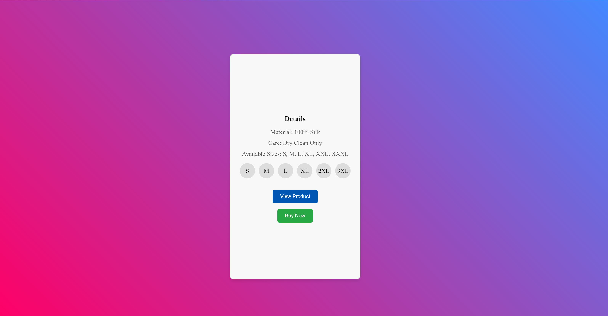

<header>
    <h1>Fashion Product Card Challenge</h1>
</header>

<nav>
    <ul>
        <li><a href="#introduction">1. Introduction</a></li>
        <li><a href="#objective">2. Objective</a></li>
        <li><a href="#preview">3. Preview</a></li>
        <li><a href="#requirements">4. Requirements</a></li>
        <li><a href="#installation">5. Installation</a></li>
        <li><a href="#project-structure">6. Project Structure</a></li>
        <li><a href="#usage">7. Usage</a></li>
        <li><a href="#styling">8. Styling</a></li>
        <li><a href="#challenges">9. Challenges</a></li>
        <li><a href="#contributing">10. Contributing</a></li>
        <li><a href="#contact">11. Contact</a></li>
    </ul>
</nav>

<section id="introduction" class="section">
    <h2>Introduction</h2>
    
This project is a simple yet elegant fashion product card that showcases a dress with an auto-sliding image carousel, size selection options, and the ability to flip the card to reveal more details. The card features a linear gradient background, interactive buttons, and is built using HTML, CSS, and JavaScript.

</section>

<section id="objective" class="section">
    <h2>Objective</h2>
    
The objective of this project is to create an interactive and visually appealing product card for showcasing fashion items.

</section>

<section id="preview" class="section">
    <h2>Preview</h2>
    
     
</section>

<section id="requirements" class="section">
    <h2>Requirements</h2>
    
To run the Fashion Product Card, you need:

    <ul>
        <li>A web browser to view the product card.</li>
        <li>A code editor for making modifications to the project files.</li>
    </ul>
</section>

<section id="installation" class="section">
    <h2>Installation</h2>
    
Follow these steps to get started with the Fashion Product Card:

    

        <pre>
git clone https://github.com/Yashi-Singh-1/Product-Card.git
cd Product-Card
        </pre>
    

    
Open <code>index.html</code> in your preferred web browser.

</section>

<section id="project-structure" class="section">
    <h2>Project Structure</h2>
    
The project includes the following files and directories:

    <ul>
        <li><code>index.html</code>: Structure of the product card.</li>
        <li><code>styles.css</code>: CSS styles for the card and its elements.</li>
        <li><code>script.js</code>: JavaScript for interactive features like the image carousel and card flip.</li>
        <li><code>images/</code>: Directory containing dress images.</li>
    </ul>
</section>

<section id="usage" class="section">
    <h2>Usage</h2>
    
Here's how you can interact with the Fashion Product Card:

    <ul>
        <li>The product card displays an auto-sliding image carousel of the dress.</li>
        <li>Click the "View Details" button to flip the card and view more information about the dress.</li>
        <li>Select a size using the circular size options.</li>
        <li>Use the "View Product" button to flip back to the front of the card.</li>
        <li>Click the "Buy Now" button to initiate a purchase (functionality to be implemented).</li>
    </ul>
</section>

<section id="styling" class="section">
    <h2>Styling</h2>
    
The card is designed with a modern look, featuring:

    <ul>
        <li>Linear gradient background for a sleek appearance.</li>
        <li>Circular size options for a user-friendly interface.</li>
    </ul>
</section>

<section id="challenges" class="section">
    <h2>Challenges</h2>
    
During development, the main challenges encountered were:

    <ul>
        <li>Ensuring image visibility and usability across various devices and screen resolutions.</li>
        <li>Implementing smooth animations and transitions for a seamless user experience.</li>
        <li>Integrating responsive design principles to optimize performance on mobile and desktop platforms.</li>
    </ul>
</section>

<section id="contributing" class="section">
    <h2>Contributing</h2>
    
Contributions are welcome to enhance the Fashion Product Card. Follow these steps:

    <ol>
        <li>Fork the repository.</li>
        <li>Create a new branch (<code>git checkout -b feature/improvement</code>).</li>
        <li>Make your changes and commit them (<code>git commit -am 'Add new feature'</code>).</li>
        <li>Push to the branch (<code>git push origin feature/improvement</code>).</li>
        <li>Create a new Pull Request.</li>
    </ol>
    
For major changes, please open an issue first to discuss potential improvements or features.

</section>

<section id="contact" class="section">
    <h2>Contact</h2>
    
For any questions or feedback, please reach out to Yashi Singh <a href="www.linkedin.com/in/yashi-singh-b4143a246" class="link">(www.linkedin.com/in/yashi-singh-b4143a246)</a>.

</section>